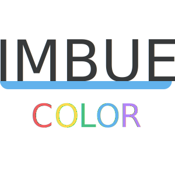

<p align="center">
  
</p>

# @imbuejs/color

<a href="https://codecov.io/gh/Rakish-Labs/imbuejs-color">
  
</a>

### An ESM color manipulation library for ESM bundlers like Snowpack and Vite with both functional and object-oriented APIs

## Installation
Install with your package manager of choice:
```
pnpm add @imbuejs/color
```
```
yarn add @imbuejs/color
```
```
npm i @imbuejs/color
```
This library exists to adopt the ES Modules standard and packages its JavaScript in ESM exclusively. If you are using a legacy module loading system such as CommonJS (`require` and `module.exports`) or UMD, check out [`color`](https://www.npmjs.com/package/color)--it inspired this library, and it's awesome!

## Usage
```
import Color from '@imbuejs/color'

/** Instantiate */
const instance = new Color('#663399') // Color {...}

/** Transform */
const rebeccaPurpleRGB = instance.rgb() // Color {...}

/** Output */
const rebeccaPurple = rebeccaPurpleRGB.toString() // 'rgb(102, 51, 153)'
```

### Color Space Tranformations
Color space transformations transform a representation of a color in one color space to a representation in another color space (hexadecimal to RGB, for example).

Although color spaces have varying precision and as a result some conversions must undergo a certain degree of rounding, the visual integrity of the color will remain mostly unchanged.

@imbuejs uses these transformations to normalize colors entered by the user in any format they wish to represent color.

#### To Hex
##### From CSS Keyword
[CSS keyword strings](https://developer.mozilla.org/en-US/docs/Web/CSS/color_value#color_keywords) are case-sensitive.
```
new Color('rebeccapurple').hex().toString() // '#663399'
new Color('palevioletred').hex().toString() // '#DB7093'
```

##### From RGB
Supports both comma `', '` and whitespace `' '` separators:
```
new Color('rgb(0 0 0)').hex().toString() // '#000000'
new Color('rgb(0, 0, 0)).hex().toString() // '#000000'
```

##### From RGBA
Supports both percentage and decimal representations for alpha channel.
Notes: 
- [Browser support for #RRGGBBAA is limited](https://caniuse.com/css-rrggbbaa)
- `rgba()` does not support whitespace `' '` separators; only `', '` may be used
```
new Color('rgba(0, 0, 0, .5)).hex().toString() // '#00000080'
new Color('rgba(0, 0, 0, 50%)).hex().toString() // '#00000080'
```

##### From HSL
Supports both comma `', '` and whitespace `' '` separators. Hue may be specified in degrees (with either no unit, or `deg`), radians (`rad`), or turns (`turn`). Saturation and lightness must be expressed as percentages.
```
new Color('hsl(0 0% 100%)').hex().toString() // '#FFFFFF'
new Color('hsl(0, 0%, 100%)').hex().toString() // '#FFFFFF'
new Color('hsl(0deg, 0%, 100%)').hex().toString() // '#FFFFFF'

new Color('hsl(6.28rad, 0%, 100%)).hex().toString() // '#FFFFFF'
new Color('hsl(.5turn, 0%, 100%)).hex().toString() // '#FFFFFF'
```

##### From HSLA
Supports both percentge and decimal representations for alpha channel.
- [Browser support for #RRGGBBAA is limited](https://caniuse.com/css-rrggbbaa)
- `hsla()` does not support whitespace `' '` separators; only `', '` may be used
```
new Color('hsla(0, 0%, 100%, .5)').hex().toString() // '#FFFFFF80'
new Color('hsla(0, 0%, 100%, 50%)').hex().toString() // '#FFFFFF80'
```

##### From... Hex?
The `hex()` instance method may be used on hex colors to normalize the three digit shorthand into six digits. Otherwise,
it returns what was passed originally.

Supports 3-digit shorthand hex codes (`'#123'`), 6-digit hex codes (`'#112233'`), and 8-digit hex codes with alpha (`'#11223300'`).

#### To RGB(A)
If no alpha channel is inferred from the incoming color, it is left off and `rgb()` is used; conversely, `rgba()` is used and alpha is denoted with decimal notation (0...1).

##### From CSS Keyword
[CSS keyword strings](https://developer.mozilla.org/en-US/docs/Web/CSS/color_value#color_keywords) are case-sensitive.
```
new Color('rebeccapurple').rgb().toString() // 'rgb(102, 51, 153)'
```

##### From Hex
Supports 3-digit shorthand hex codes (`'#123'`), 6-digit hex codes (`'#112233'`), and 8-digit hex codes with alpha (`'#11223300'`).
```
new Color('#000').rgb().toString() // 'rgb(0, 0, 0)'
new Color('#000000').rgb().toString() // 'rgb(0, 0, 0)'
new Color('#00000080').rgb().toString() // 'rgba(0, 0, 0, .5)'
```

##### From HSL
Supports both comma `', '` and whitespace `' '` separators. Hue may be specified in degrees (with either no unit, or `deg`), radians (`rad`), or turns (`turn`). Saturation and lightness must be expressed as percentages.
```
new Color('hsl(0 0% 100%)').rgb().toString() // 'rgb(255, 255, 255)'
new Color('hsl(0, 0%, 100%)').rgb().toString() // 'rgb(255, 255, 255)'
new Color('hsl(0deg, 0%, 100%)').rgb().toString() // 'rgb(255, 255, 255)'

new Color('hsl(6.28rad, 0%, 100%)).rgb().toString() // 'rgb(255, 255, 255)'
new Color('hsl(.5turn, 0%, 100%)).rgb().toString() // 'rgb(255, 255, 255)'
```

##### From HSLA
Supports both percentge and decimal representations for alpha channel.
- `hsla()` does not support whitespace `' '` separators; only `', '` may be used
```
new Color('hsla(0, 0%, 100%, .5)').rgb().toString() // 'rgba(255, 255, 255, .5)'
new Color('hsla(0, 0%, 100%, 50%)').rgb().toString() // 'rgba(255, 255, 255, .5)'
```

##### From RGB(A)
The original value passed will be returned.
```
new Color('rgb(0, 128, 255)').rgb().toString() // 'rgb(000, 128, 255)'
new Color('rgba(0, 128, 255, .5)').rgb().toString() // 'rgba(0, 128, 255, .5)'
```

### Visual Color Transformations
Visual color transformations refer to transformations that do change the visual appearance of a color.

#### Channel setters
When transforming a color based upon a known channel value, you may simply set the known channel's value:
```
const color = new Color('#ff0000)
color.red = 0

color.toString() // 'rgb(0, 0, 0)'

const hslBlack = new Color(color).hsl().toString() // 'hsl()'
```
When the color space is inferrable from the setter, as in the above example in which `red` is a channel of `rgb()`, the `Color` class' color space is updated. When it cannot be inferred, such as with `alpha` which is present in multiple color spaces, `rgb()` is assumed; additional color space transformations can be made from there to transform the setter-transformed color to the desired color space.

##### `Color.red`
```
const color = new Color('#ff0000)
color.red = 0
color.toString() // 'rgb(0, 0, 0)'
```
##### `Color.green`
```
const color = new Color('#00ff00)
color.green = 0
color.toString() // 'rgb(0, 0, 0)'
```
##### `Color.blue`
```
const color = new Color('#0000ff')
color.blue = 0
color.toString() // 'rgb(0, 0, 0)'
```
##### `alpha`
```
const color = new Color('#000000')
color.alpha = 0

color.toString() // 'rgba(0, 0, 0, 0)'

const hexTransparent = new Color(color).hex().toString()
hexTransparent.toString() // '#00000000'
```

### Outputs
#### `Color.toString()`
Returns the string representation of the current color. Without transformation, it will return the original value passed.

#### `Color.red`
Returns the red channel of the current color in the range of `0...255`.

#### `Color.green`
Returns the green channel of the current color in the range of `0...255`.

#### `Color.blue`
Returns the blue channel of the current color in the range of `0...255`.

## Contributing
Don't see a color space transformation you need? Don't see a visual color transformation you need? Don't see the output you need? Create an issue outlining your desired tranformation or output format, and your desired API, and the roadmap may be adjusted accordingly. If what you need is urgent, pull requests are welcome! Please see our [Contribution Guidelines](./docs/contribution-guidelines.md).

## Issues
Something not working the way you expect? Have a usage question? [Open up an issue.](https://github.com/Rakish-Labs/imbuejs-color/issues/new?assignees=&labels=&template=bug_report.md&title=)

## AMA
Have a question about how to use the library? This is a safe space! No question is too naïve, specific, broad, or esoteric, and no question is dumb! [AMA!](https://github.com/Rakish-Labs/imbuejs-color/issues/new?assignees=jeffDevelops&labels=question&template=question.md&title=%5BQUESTION%5D)

## Roadmap
In planned order of implementation based on browser support:

- [ ] Color Space Transformations: 
  - [ ] `Color.hsl()` [(ubiquitous browser support)](https://caniuse.com/?search=hsla)

- [ ] Visual Color Transformations:
  - [ ] `Color.hue('<value><deg|rad|turn>')`, to apply a new hue channel value to the current `Color` and return a new one in hsl(a)
  - [ ] `Color.saturation('0...100%')`, to apply a new saturation channel value to the current `Color` and return a new one in hsl(a)
  - [ ] `Color.lightness('0...100%')`, to apply a new lightness channel value to the current `Color` and return a new one in hsl(a)

- [ ] Expose Functional API:
  The `Color` class already makes use of an extensively modular functional API--it'll just be a matter of exposing it via ESM modules. Some highlights:
  - Color space validation functions
  - Conversion functions such as `hexToRGB('#000000')`, to reduce downstream bundle sizes

- [ ] Visual Color Transformations:
  - [ ] `Color.hueShift()`
  - [ ] `Color.saturate()`
  - [ ] `Color.desaturate()`
  - [ ] `Color.grayscale()`
  - [ ] `Color.negate()`
  - [ ] `Color.rotate()`

- [ ] Color Space Transformations: 
  - [ ] `Color.hwb()` [(ubiquitous browser support)](https://caniuse.com/?search=hwb)
  - [ ] `Color.lab()` [(currently Safari only)](https://caniuse.com/?search=lab%20color)
  - [ ] `Color.lch()` [(currently Safari only)](https://caniuse.com/?search=lch%20color)
  - [ ] `Color.cmyk()` (no browser support)


